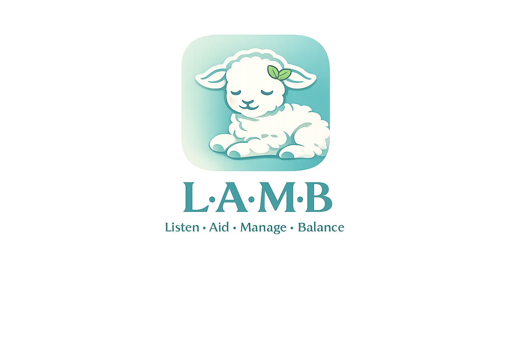

# L.A.M.B

<p align="center">
  
</p>

<p align="center">
  <strong>Listen. Aid. Manage. Balance.</strong><br />
  A private-pilot mental health and addictions support app for between-visit tracking, clinician review, and safer follow-up.
</p>

<p align="center">
  <a href="https://github.com/jakedruken-afk/Emotion-tracker/actions/workflows/ci.yml"></a>
  <a href="https://github.com/jakedruken-afk/Emotion-tracker/actions/workflows/release.yml"></a>
  <a href="https://github.com/jakedruken-afk/Emotion-tracker/actions/workflows/deploy.yml"></a>
  <a href="https://github.com/jakedruken-afk/Emotion-tracker/actions/workflows/server-backup.yml"></a>
</p>

## What L.A.M.B Does

L.A.M.B is built to help care teams see the parts of daily life they miss between appointments.
It gives patients a calmer check-in flow, gives support workers a triage and review workspace,
and gives clinicians a separate doctor-ready review page with summaries, screening, medications,
care planning, and follow-up context in one place.

This app is meant to support clinical pattern review and safer follow-up. It is not a diagnosis
engine and it is not a lie detector.

## Current Pilot Features

- Patient mood check-ins with structured context
- Optional one-time GPS snapshot with separate consent
- Morning and night sleep reports
- Weekly safety and symptom screening with richer follow-up questions
- Support-worker dashboard with priority queue, trend review, and local care pathways
- Separate doctor review page with printable visit summary, visit questions, medications, and care plan
- Invite-only onboarding for private pilots
- Server-backed sessions with `httpOnly` cookies
- Consent records, assignment-based access, and audit logging
- Backup, restore, release bundle, and GitHub-driven deploy support

## Product Flow

### Patient Side

- Log in through an invite-created account
- Complete privacy and consent choices
- Record mood, sleep, and weekly screening data
- Keep a simple history of personal entries

### Support Side

- Review assigned patients only
- Use a priority queue to focus follow-up
- Add observations and care notes
- Manage invites and patient-to-staff assignments
- Open the doctor review page for a selected patient

### Doctor Review

- Read a concise chart-ready visit summary
- Review weekly screening status and risk signals
- See sleep, mood, and substance-use related trends
- Update clinician-managed medications and care plan
- Print or copy visit notes for case review

## Tech Stack

- `Vite + React + TypeScript`
- `Express + TypeScript`
- Node built-in `node:sqlite`
- `PM2` for production process management
- `Caddy` as the recommended HTTPS reverse proxy
- `GitHub Actions` for CI, release bundles, deploys, and server backups

## Local Development

### Requirements

- Node.js `22+`
- npm

### Run Locally

```powershell
npm install
npm run dev
```

- Frontend: `http://localhost:5173`
- API: `http://localhost:3001`

### Demo Accounts

- Patient: `patient1` / `demo123`
- Support worker: `support1` / `demo123`

Demo accounts are for local development only. In production mode, L.A.M.B expects clinician-managed onboarding and demo seeding should be turned off.

## Secure Pilot Features

- Server-backed sign-in with `httpOnly` cookies
- Password hashing
- Assignment-based patient access
- Invite-only onboarding
- Patient consent records for mood, sleep, weekly screening, and GPS
- GPS off by default until explicit consent is given
- Audit logging for sign-in, views, writes, invites, assignments, medications, care plans, and consent changes

## Environment Setup

Copy `.env.example` to `.env` and update it for your environment. The server and maintenance
scripts load `.env` automatically from the project root.

Important production settings:

```dotenv
NODE_ENV=production
LAMB_PRODUCTION_MODE=true
SESSION_SECRET=replace-with-a-long-random-secret
APP_BASE_URL=https://your-domain.example
DATABASE_PATH=/srv/lamb-pilot/shared/data/emotion-tracker.db
BACKUP_DIR=/srv/lamb-pilot/shared/backups
ENABLE_DEMO_SEED=false
TRUST_PROXY=true
```

Before the first live sign-in, create the first support account:

```powershell
npm run bootstrap:support -- --username pilot-support --first-name Pilot --last-name Lead
```

## GitHub Workflows

### CI

[`ci.yml`](.github/workflows/ci.yml)

- Runs on pushes to `main` and on pull requests
- Installs dependencies
- Runs `npm run check`
- Runs `npm run build`

### Release

[`release.yml`](.github/workflows/release.yml)

- Runs on version tags like `v0.1.0`
- Can also run manually
- Builds a release bundle
- Uploads the bundle as a workflow artifact
- Publishes the bundle to a GitHub release

### Deploy

[`deploy.yml`](.github/workflows/deploy.yml)

- Manual workflow
- Builds the selected Git ref
- Uploads a built bundle to the live server over SSH
- Applies the release with [`deploy/apply-release.sh`](deploy/apply-release.sh)
- Reloads the app through PM2

### Server Backup

[`server-backup.yml`](.github/workflows/server-backup.yml)

- Manual workflow
- Triggers `npm run backup` on the live server
- Downloads the newest backup into the GitHub Actions run
- Uploads the backup as an artifact

## Releases And Backup Commands

### Build A Local Release Bundle

```powershell
npm run release:bundle -- v0.1.0
```

### Create A Local Backup

```powershell
npm run backup
```

### Restore From Backup

```powershell
npm run restore -- .\backups\emotion-tracker-YYYYMMDD-HHMMSS.db
```

Stop the running app before a restore so the SQLite files are not being written to during the operation.

## Live Deployment

Production deployment guidance lives in [docs/DEPLOYMENT.md](docs/DEPLOYMENT.md).

Included support files:

- [`deploy/Caddyfile.example`](deploy/Caddyfile.example)
- [`deploy/apply-release.sh`](deploy/apply-release.sh)
- [`ecosystem.config.cjs`](ecosystem.config.cjs)

## Repository Notes

- The local SQLite database is ignored by Git
- `node_modules`, build output, `.env`, backups, and temp files stay out of the repo
- The app can be developed on Windows, but the included live deployment flow targets a Linux server

## Roadmap Direction

The app is already moving beyond simple mood logging and toward a stronger clinical pilot:

- richer patient daily data
- safer screening workflows
- assignment-based staff review
- doctor-specific review pages
- release, backup, and deploy operations from GitHub

The next major layers after a stable pilot are likely deeper accessibility, broader clinical summaries, and health-system integration.
