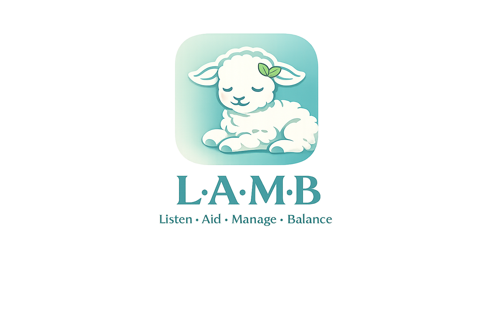

# L.A.M.B

<p align="center">
  
</p>

<p align="center">
  <strong>Listen. Aid. Manage. Balance.</strong><br />
  A private-pilot mental health and addictions support app for between-visit tracking, clinician review, and safer follow-up.
</p>

<p align="center">
  <a href="https://github.com/jakedruken-afk/Emotion-tracker/actions/workflows/ci.yml"></a>
  <a href="https://github.com/jakedruken-afk/Emotion-tracker/actions/workflows/release.yml"></a>
  <a href="https://github.com/jakedruken-afk/Emotion-tracker/actions/workflows/deploy.yml"></a>
  <a href="https://github.com/jakedruken-afk/Emotion-tracker/actions/workflows/server-backup.yml"></a>
</p>

## What L.A.M.B Does

L.A.M.B is built to help care teams see the parts of daily life they miss between appointments.
It gives patients a calmer check-in flow, gives support workers a triage and review workspace,
and gives clinicians a separate doctor-ready review page with summaries, screening, medications,
care planning, and follow-up context in one place.

This app is meant to support clinical pattern review and safer follow-up. It is not a diagnosis
engine and it is not a lie detector.

## Current Pilot Features

- Patient mood check-ins with structured context
- Optional one-time GPS snapshot with separate consent
- Morning and night sleep reports
- Weekly safety and symptom screening with richer follow-up questions
- Support-worker dashboard with priority queue, trend review, and local care pathways
- Separate doctor review page with printable visit summary, visit questions, medications, and care plan
- Invite-only onboarding for private pilots
- Optional invite email delivery through a verified L.A.M.B. sending domain
- Server-backed sessions with cookie or header transport for hybrid patient shells
- Patient-side offline drafts, queued retry, and visible sync status
- Synthetic demo mode with resettable fake patient scenarios
- Pilot snapshot metrics for consent, data quality, and alert acknowledgement
- Consent records, assignment-based access, and audit logging
- Backup, restore, release bundle, and GitHub-driven deploy support

## Product Flow

### Patient Side

- Log in through an invite-created account
- Complete privacy and consent choices
- Record mood, sleep, and weekly screening data
- Keep a simple history of personal entries

### Support Side

- Review assigned patients only
- Use a priority queue to focus follow-up
- Add observations and care notes
- Manage invites and patient-to-staff assignments
- Open the doctor review page for a selected patient

### Doctor Review

- Read a concise chart-ready visit summary
- Review weekly screening status and risk signals
- See sleep, mood, and substance-use related trends
- Update clinician-managed medications and care plan
- Print or copy visit notes for case review

## Tech Stack

- `Vite + React + TypeScript`
- `Express + TypeScript`
- Node built-in `node:sqlite`
- `PM2` for production process management
- `Caddy` as the recommended HTTPS reverse proxy
- `GitHub Actions` for CI, release bundles, deploys, and server backups

## Local Development

### Requirements

- Node.js `22+`
- npm

### Run Locally

```powershell
npm install
npm run dev
```

- Frontend: `http://localhost:5173`
- API: `http://localhost:3001`

### Demo Accounts

- Patient: `patient1` / `demo123`
- Support worker: `support1` / `demo123`

Demo accounts are for local development only. In production mode, L.A.M.B expects clinician-managed onboarding and demo seeding should be turned off.

Synthetic demo scenarios can be reset from the support dashboard when `ENABLE_DEMO_SEED=true`.

## Secure Pilot Features

- Server-backed sign-in with `httpOnly` cookies
- Header-session support for hybrid patient shells
- Password hashing
- Assignment-based patient access
- Invite-only onboarding
- Patient consent records for mood, sleep, weekly screening, and GPS
- Staffed-hours and emergency-limit acknowledgement in consent
- GPS off by default until explicit consent is given
- Audit logging for sign-in, views, writes, invites, assignments, medications, care plans, and consent changes

## Environment Setup

Copy `.env.example` to `.env` and update it for your environment. The server and maintenance
scripts load `.env` automatically from the project root.

Important production settings:

```dotenv
NODE_ENV=production
LAMB_PRODUCTION_MODE=true
SESSION_SECRET=replace-with-a-long-random-secret
APP_BASE_URL=https://app.lambpilot.ca
VITE_API_BASE_URL=https://app.lambpilot.ca
RESEND_API_KEY=replace-with-resend-api-key
INVITE_EMAIL_FROM=L.A.M.B. <invites@notify.lambpilot.ca>
INVITE_EMAIL_REPLY_TO=support@lambpilot.ca
DATABASE_PATH=/srv/lamb-pilot/shared/data/emotion-tracker.db
BACKUP_DIR=/srv/lamb-pilot/shared/backups
ENABLE_DEMO_SEED=false
TRUST_PROXY=true
MOBILE_ALLOWED_ORIGINS=capacitor://localhost,ionic://localhost
```

Before the first live sign-in, create the first support account:

```powershell
npm run bootstrap:support -- --username pilot-support --first-name Pilot --last-name Lead
```

### Invite Email Delivery

Invite links are created by the backend and can be emailed automatically when email delivery is
configured. The Cloudflare Worker integration uses Resend's Email API.

To send from a L.A.M.B. company address:

1. Use the verified `notify.lambpilot.ca` sending domain in Resend.
2. Confirm SPF/DKIM verification is still green in Resend.
3. Set the Worker secret:

```bash
npx wrangler -c wrangler.worker.toml secret put RESEND_API_KEY
```

4. Set the non-secret sender values in `wrangler.worker.toml` after the domain is verified:

```toml
INVITE_EMAIL_FROM = "L.A.M.B. <invites@notify.lambpilot.ca>"
INVITE_EMAIL_REPLY_TO = "support@lambpilot.ca"
```

5. Deploy the backend:

```bash
npx wrangler -c wrangler.worker.toml deploy
```

If email is not configured or the email provider rejects a send, the invite is still created and the
admin/support UI will show the activation link so it can be copied manually.

## GitHub Workflows

### CI

[`ci.yml`](.github/workflows/ci.yml)

- Runs on pushes to `main` and on pull requests
- Installs dependencies
- Runs `npm run check`
- Runs `npm run build`

### Release

[`release.yml`](.github/workflows/release.yml)

- Runs on version tags like `v0.1.0`
- Can also run manually
- Builds a release bundle
- Uploads the bundle as a workflow artifact
- Publishes the bundle to a GitHub release

### Deploy

[`deploy.yml`](.github/workflows/deploy.yml)

- Manual workflow
- Builds the selected Git ref
- Uploads a built bundle to the live server over SSH
- Applies the release with [`deploy/apply-release.sh`](deploy/apply-release.sh)
- Reloads the app through PM2

### Server Backup

[`server-backup.yml`](.github/workflows/server-backup.yml)

- Manual workflow
- Triggers `npm run backup` on the live server
- Downloads the newest backup into the GitHub Actions run
- Uploads the backup as an artifact

## Releases And Backup Commands

### Build A Local Release Bundle

```powershell
npm run release:bundle -- v0.1.0
```

### Create A Local Backup

```powershell
npm run backup
```

### Restore From Backup

```powershell
npm run restore -- .\backups\emotion-tracker-YYYYMMDD-HHMMSS.db
```

Stop the running app before a restore so the SQLite files are not being written to during the operation.

## Live Deployment

Production deployment guidance lives in [docs/DEPLOYMENT.md](docs/DEPLOYMENT.md).

## Cloudflare Worker D1 Backend

This repo also includes a standalone Hono + Cloudflare D1 backend at [`src/server.ts`](src/server.ts). It is separate from the existing Express pilot server and is configured by [`wrangler.toml`](wrangler.toml).

Install the Worker dependencies:

```powershell
npm install hono
npm install -D wrangler
```

Create the D1 database in the region required by your PHIPA/PIPEDA data-residency plan. The schema notes use Eastern North America as the Canadian-proximate option:

```powershell
npx wrangler d1 create lamb_db --location=enam
```

Copy the returned `database_id` into `wrangler.toml`, then migrate the schema:

```powershell
npx wrangler d1 execute DB --file=db_schema.sql
```

If Wrangler expects the database name instead of the binding in your local version, use:

```powershell
npx wrangler d1 execute lamb_db --file=db_schema.sql
```

Set production secrets before deploy. Do not leave real secrets in `wrangler.toml`:

```powershell
npx wrangler secret put JWT_SECRET
npx wrangler secret put BCRYPT_SALT
```

Run locally:

```powershell
npx wrangler dev
```

Deploy:

```powershell
npx wrangler deploy
```

Optional type check for the Worker entrypoint:

```powershell
npx tsc -p tsconfig.worker.json
```

Compliance reminders for clinical use:

- Get informed consent before collecting personal health information.
- Keep data encrypted at rest and in transit; D1 provides encryption at rest, and Workers traffic uses TLS.
- Store data in the Canadian/approved residency region for the pilot and verify the current Cloudflare regional guarantees for your account.
- Preserve audit trails through `access_log` and `log_edits`; do not disable them in production.
- Treat this as technical implementation guidance, not legal advice.

## Mobile Pilot

Patient-first mobile and pilot-safety guidance lives in [docs/MOBILE_PILOT.md](docs/MOBILE_PILOT.md).
Pitch-readiness, website beta testing, and sanitized feedback capture live in:

- [docs/PITCH_READINESS_PLAN.md](docs/PITCH_READINESS_PLAN.md)
- [docs/BETA_TEST_SCRIPT.md](docs/BETA_TEST_SCRIPT.md)
- [docs/BETA_FEEDBACK_LOG_TEMPLATE.md](docs/BETA_FEEDBACK_LOG_TEMPLATE.md)

Useful Android commands:

```powershell
npm run mobile:sync:android
npm run mobile:open:android
npm run mobile:run:android
```

### Desktop Batch Files

Two desktop helper files were added for quick access on Windows:

- `Open LAMB Project.cmd`
  - Opens the project folder in File Explorer
  - Opens the Android Studio project if Android Studio is installed
- `Start LAMB Android Dev.cmd`
  - Starts the API server with `npm run dev:server`
  - Opens the Android Studio project
  - Opens the project folder in File Explorer

Recommended use:

- Use `Open LAMB Project.cmd` when you only want to look at files or reopen the Android project
- Use `Start LAMB Android Dev.cmd` when you want to resume Android testing and need the local API running

If Android login ever shows `Failed to fetch`, make sure the API server window opened by `Start LAMB Android Dev.cmd` is still running and that the app is listening on `http://localhost:3001`.

Included support files:

- [`deploy/Caddyfile.example`](deploy/Caddyfile.example)
- [`deploy/apply-release.sh`](deploy/apply-release.sh)
- [`ecosystem.config.cjs`](ecosystem.config.cjs)

## Repository Notes

- The local SQLite database is ignored by Git
- `node_modules`, build output, `.env`, backups, and temp files stay out of the repo
- The app can be developed on Windows, but the included live deployment flow targets a Linux server

## Roadmap Direction

The app is already moving beyond simple mood logging and toward a stronger clinical pilot:

- richer patient daily data
- safer screening workflows
- assignment-based staff review
- doctor-specific review pages
- release, backup, and deploy operations from GitHub

The next major layers after a stable pilot are likely deeper accessibility, broader clinical summaries, and health-system integration.
